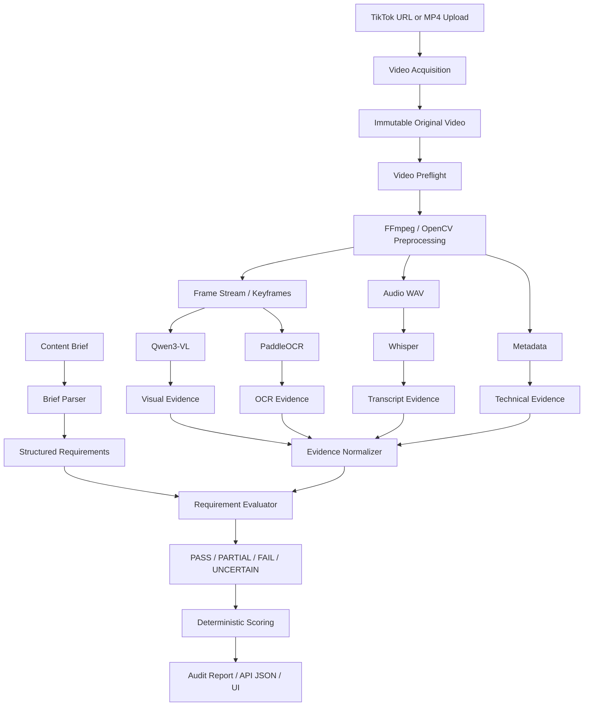
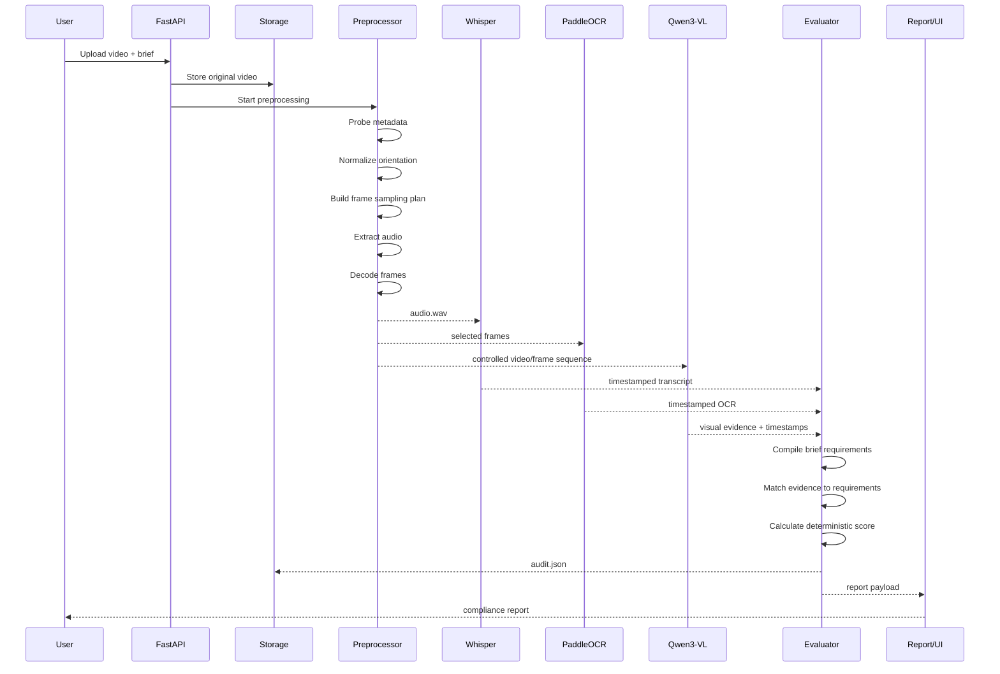
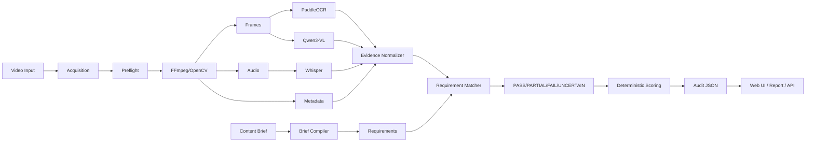

# Product Specification — AI TikTok Video Brief Compliance & Creative Audit System

## 0. Executive Summary

This product is an AI-powered video auditing system for short-form social videos, initially TikTok. It accepts a video (and later a TikTok URL) plus a brand/product content brief, watches and analyzes the video, extracts multimodal evidence, checks each brief requirement, identifies the hook, detects missing or weak requirements, flags risky claims, and produces a timestamped compliance/creative report.

The core product question is:

> **“Given what the brief says should happen, what actually happened in the video, and where is the evidence?”**

The system is designed to start **without a labeled training dataset**. The MVP uses pretrained open-weight models and deterministic application logic. Human corrections become the seed dataset for future evaluation improvement and fine-tuning.

The recommended initial stack is:

- **Video processing:** FFmpeg + OpenCV
- **Video understanding:** Qwen3-VL, initially benchmark **Qwen/Qwen3-VL-4B-Instruct** and **Qwen/Qwen3-VL-8B-Instruct**
- **Speech recognition:** OpenAI Whisper
- **OCR:** PaddleOCR / PP-OCRv6
- **Brief retrieval:** BGE-M3 + Qdrant when multi-brand retrieval becomes necessary
- **Inference serving:** vLLM where supported/appropriate
- **Backend:** FastAPI + Pydantic
- **Frontend:** Next.js / React
- **Storage:** object storage + PostgreSQL; optional Redis for job state
- **Evaluation:** deterministic rule engine over structured evidence, with LLM-assisted interpretation only where ambiguity requires it

Qwen3-VL is particularly relevant because its current official repository documents video understanding, timestamp-oriented temporal grounding, OCR-related capabilities, and local-video processing. It also supports configurable video frame sampling. [Qwen3-VL official repository](https://github.com/QwenLM/Qwen3-VL) and [Qwen3-VL video cookbook](https://github.com/QwenLM/Qwen3-VL/blob/main/cookbooks/video_understanding.ipynb).

---

# 1. Product Vision

The long-term product is not simply a “video summarizer.” It is a **Content Brief Compiler + Video Evidence Engine + Compliance Evaluator**.

A brand writes a brief in natural language:

```text
Show the product within the first 5 seconds.
Open with a strong hook.
Demonstrate how the product is used.
Mention hydration and barrier support.
Speak to teens/tweens.
End with a clear CTA.
Do not make medical claims.
```

The platform compiles that brief into machine-checkable requirements:

```json
{
  "requirements": [
    {
      "id": "R1",
      "type": "visual",
      "requirement": "Product visible",
      "deadline_seconds": 5
    },
    {
      "id": "R2",
      "type": "hook",
      "requirement": "Strong opening hook",
      "window_seconds": 3
    },
    {
      "id": "R3",
      "type": "demonstration",
      "requirement": "Show product use"
    },
    {
      "id": "R4",
      "type": "speech",
      "requirement": "Mention hydration"
    },
    {
      "id": "R5",
      "type": "speech",
      "requirement": "Mention barrier support"
    },
    {
      "id": "R6",
      "type": "audience",
      "requirement": "Target teens/tweens"
    },
    {
      "id": "R7",
      "type": "cta",
      "requirement": "Include CTA"
    },
    {
      "id": "R8",
      "type": "policy",
      "requirement": "No medical claims"
    }
  ]
}
```

Then the video is transformed into evidence:

```text
Video
  ├── Frames
  ├── Audio transcript
  ├── On-screen text
  ├── Scene/events
  ├── Product visibility
  ├── Actions/demonstrations
  └── Candidate hook / CTA / claims
```

Finally, the evaluator joins the two:

```text
CONTENT BRIEF
      │
      ▼
Structured Requirements
      │
      │            VIDEO
      │              │
      │              ▼
      │        Multimodal Evidence
      │              │
      └──────────────┼──────────────┐
                     ▼              │
              Requirement Match    │
                     │              │
                     ▼              │
             PASS / PARTIAL /      │
             FAIL / UNCERTAIN      │
                     │              │
                     ▼              │
               Score + Report ◄────┘
```

---

# 2. Goals and Non-Goals

## 2.1 MVP goals

The MVP must:

1. Accept an MP4 video upload.
2. Store the original asset immutably.
3. Inspect video metadata.
4. Extract or decode frames with reliable timestamps.
5. Extract audio.
6. Generate a timestamped transcript.
7. Extract on-screen text.
8. Send video evidence to Qwen3-VL.
9. Parse the content brief into structured requirements.
10. Evaluate every requirement using explicit evidence.
11. Detect the hook and determine whether it appears inside the required opening window.
12. Identify missing and weak requirements.
13. Produce machine-readable JSON.
14. Produce a human-readable report.
15. Preserve timestamps so every important claim can be inspected.

## 2.2 Explicit non-goals for MVP

Do not initially attempt to:

- train a video VLM from scratch;
- fine-tune Qwen3-VL before collecting correction data;
- build a perfect TikTok downloader/scraper;
- infer subjective “virality” as a hard truth;
- build a specialized product detector unless benchmarks prove it is necessary;
- automatically decide legal/compliance questions that require human/legal review;
- optimize model architecture before a benchmark dataset exists.

---

# 3. Core Product Principles

## Principle 1 — Separate “what should happen” from “what happened”

The brief layer defines desired behavior. The video layer extracts evidence. The evaluator performs the comparison.

## Principle 2 — Evidence first, prose second

The LLM should not be the system of record. Structured evidence is the source of truth. The prose report is generated from that structured evidence.

## Principle 3 — Preserve time

Every meaningful observation should be linked to a timestamp or interval where possible.

## Principle 4 — Use uncertainty explicitly

Do not force every requirement into PASS/FAIL. A model may not have sufficient evidence. Use:

- `PASS`
- `PARTIAL`
- `FAIL`
- `UNCERTAIN`
- optionally `NOT_APPLICABLE`

## Principle 5 — Deterministic scoring

The application computes scores from statuses and weights. The LLM may suggest evidence/status, but should not invent arbitrary numerical scores.

## Principle 6 — Specialize models

Use:

```text
FFmpeg/OpenCV = video mechanics
Whisper       = speech
PaddleOCR     = text in frames
Qwen3-VL      = visual + temporal reasoning
LLM/rules     = requirement matching
```

---

# 4. High-Level Architecture



---

# 5. Component Ownership Map

| Module | Responsibility | Model/Tool | MVP? |
|---|---|---|---|
| Acquisition | URL/upload → local MP4 | HTTP/object storage/manual upload | Yes, upload first |
| Preflight | Validate file, metadata, corruption | FFprobe/FFmpeg | Yes |
| Frame processing | Decode/sample/resize frames | FFmpeg + OpenCV + optional Qwen video utility | Yes |
| Audio processing | Extract normalized audio | FFmpeg | Yes |
| ASR | Speech → timestamps | Whisper | Yes |
| OCR | Text overlays → timestamps | PaddleOCR | Yes |
| Video understanding | Actions, scenes, product, visual events | Qwen3-VL | Yes |
| Brief parser | Natural brief → requirements | LLM + Pydantic | Yes |
| Evidence normalizer | Merge all modalities | Python | Yes |
| Requirement evaluator | Evidence → status | Rules + LLM adjudication | Yes |
| Scoring | Weighted score | Python | Yes |
| Reporting | JSON + human report | FastAPI/backend | Yes |
| RAG | Retrieve reusable brief knowledge | BGE-M3 + Qdrant | Later |
| Product detector | Dedicated detection | YOLO/Grounding DINO | Later, if needed |
| Fine-tuning | Reduce systematic errors | Qwen/PEFT/LoRA | Later |

---

# 6. Video Acquisition Layer

## 6.1 MVP decision

**Accept MP4 uploads first.** Do not make TikTok URL acquisition a hard dependency for the first working version.

Why:

- video URLs can be volatile;
- authentication/access behavior changes;
- network failures become mixed with AI failures;
- reproducibility is much easier with immutable local/object-storage files;
- the evaluator can be tested with the same video repeatedly.

The system interface should still allow:

```json
{
  "source_type": "upload",
  "source_uri": "s3://bucket/video_123.mp4"
}
```

Later:

```json
{
  "source_type": "tiktok_url",
  "source_uri": "https://www.tiktok.com/..."
}
```

The acquisition layer should be isolated from the evaluator so TikTok-specific acquisition code can be changed without changing downstream modules.

---

# 7. Video Preflight — First Step Before AI

Before running any AI model, inspect the media.

## 7.1 What to detect

- file size
- MIME type
- extension
- duration
- width/height
- aspect ratio
- FPS
- frame count, if available
- video codec
- audio codec
- sample rate
- number of audio channels
- variable-frame-rate indicators
- presence/absence of audio
- decode errors
- rotation/orientation metadata

## 7.2 Example preflight object

```json
{
  "video_id": "vid_001",
  "path": "/data/original.mp4",
  "duration_seconds": 27.42,
  "width": 1080,
  "height": 1920,
  "fps": 30.0,
  "frame_count": 823,
  "aspect_ratio": 0.5625,
  "has_audio": true,
  "audio_sample_rate": 48000,
  "video_codec": "h264",
  "audio_codec": "aac",
  "rotation": 0
}
```

The exact available metadata depends on the media container and decoder. FFprobe is preferred for authoritative file-level inspection; OpenCV can then be used to decode frames programmatically.

---

# 8. THE VIDEO PROCESSING PIPELINE — DETAILED DESIGN

This is the most important engineering section because **video processing is the bridge between a raw social video and a VLM**.

The core question is not:

> “How do I convert MP4 into images?”

It is:

> “How do I preserve enough temporal, visual, textual and audio information while controlling compute, memory, latency and noise?”

---

# 9. Raw Video → Processing Assets

Start with:

```text
                       original.mp4
                            │
                            ▼
                    ┌──────────────┐
                    │    ffprobe   │
                    └──────┬───────┘
                           │
                       metadata
                           │
                           ▼
                  ┌─────────────────┐
                  │ Preflight rules │
                  └────────┬────────┘
                           │
                           ▼
                  ┌─────────────────┐
                  │     FFmpeg      │
                  └───────┬─────────┘
            ┌─────────────┼─────────────┐
            ▼             ▼             ▼
        audio.wav     frame stream    normalized.mp4
            │             │             │
            ▼             ▼             │
         Whisper       OpenCV          │
                          │             │
                          ├── OCR       │
                          │             │
                          └── Qwen3-VL ◄┘
```

---

# 10. Step 1 — Decode the Video

A video file is compressed. The VLM does not conceptually receive “the TikTok” as a magical object. At some point the system must decode it into visual information.

OpenCV's `VideoCapture` can open video files and `read()` decodes successive frames. See the official [OpenCV VideoCapture documentation](https://docs.opencv.org/doc/doxygen/html/d8/dfe/classcv_1_1VideoCapture.html).

Basic decoding concept:

```python
import cv2

cap = cv2.VideoCapture("original.mp4")

if not cap.isOpened():
    raise RuntimeError("Cannot open video")

fps = cap.get(cv2.CAP_PROP_FPS)
frame_count = cap.get(cv2.CAP_PROP_FRAME_COUNT)

while True:
    ok, frame = cap.read()
    if not ok:
        break

    # frame is a decoded image
    # process or sample it here

cap.release()
```

### Important limitation

Do not assume the raw integer frame index is a perfect timestamp in every video. Variable frame rate, decoder behavior, B-frames and container metadata can make naïve `frame_index / fps` logic unreliable.

**Decision:** whenever precise timestamps matter, obtain timestamps from a decoder/metadata path that actually exposes them, and store both frame index and timestamp when possible.

Qwen's current video tooling also supports returning video metadata and uses video-aware preprocessing; this should be benchmarked against your own FFmpeg/OpenCV timestamp pipeline rather than blindly duplicating both paths. [Qwen3-VL repository](https://github.com/QwenLM/Qwen3-VL).

---

# 11. Step 2 — Why We Cannot Send Every Frame

Suppose a video is:

```text
30 seconds
30 FPS
```

Then:

```text
30 × 30 = 900 frames
```

A typical TikTok could easily have hundreds or thousands of frames.

Sending everything can create:

- excessive vision-token cost;
- high VRAM usage;
- longer inference latency;
- repetitive information;
- diminishing returns because adjacent frames may be almost identical.

Therefore the preprocessing layer needs a **sampling policy**.

---

# 12. Sampling Is a Product Decision, Not Just a Technical Detail

A sampling system must optimize for the information your evaluator cares about.

Your evaluator particularly cares about:

- first 1–3 seconds for the hook;
- first appearance of the product;
- product demonstration;
- transitions/scenes;
- text overlays;
- CTA near the end;
- moments related to claims or required actions.

Therefore uniform sampling alone is not ideal.

---

# 13. Recommended Sampling Strategy — Hybrid Sampling

Use three levels.

```text
LEVEL 1 — GLOBAL COVERAGE
Sample the entire video at a moderate FPS.

LEVEL 2 — CRITICAL WINDOWS
Oversample the first 3–5 seconds and final 3–5 seconds.

LEVEL 3 — ADAPTIVE REFINEMENT
When an important event/transition/text/product appearance is detected,
extract additional nearby frames.
```

Diagram:

```text
30-second video

0s                                                    30s
|------------------------------------------------------|
||||||||||||||||||||||||||||||||||||||||||||||||||||||
       global sampling, e.g. ~1–2 FPS

||||||||||||||                                        ||||||||||||||
0–5s dense window                                  last 3–5s dense window

                 ^
                 |
         adaptive refinement
       around detected events
```

Qwen3-VL's official examples currently support configurable video sampling rates; the repository also documents frame-list inputs with a `sample_fps` field and vLLM-side FPS controls. This means you can benchmark direct-video inference against your own extracted-frame path. [Qwen3-VL README](https://github.com/QwenLM/Qwen3-VL).

---

# 14. Recommended MVP Frame Budget

Do not hard-code one global number forever. Start with a policy based on duration.

Suggested starting policy for benchmarking:

```text
Video duration          Global target
0–10 s                   20–30 frames
10–30 s                  30–60 frames
30–60 s                  60–90 frames
60–180 s                 90–180 frames
>180 s                   cap + adaptive sampling
```

These are **engineering starting points, not claims of model optimality**. Your benchmark should determine the best frame budget for your actual TikTok population.

Qwen's own VideoMME evaluation code demonstrates an FPS-based approach with configurable minimum and maximum frame counts and timestamps. That implementation is useful as a reference for your sampler design. [Qwen3-VL VideoMME utilities](https://github.com/QwenLM/Qwen3-VL/blob/main/evaluation/VideoMME/dataset_utils.py).

---

# 15. Step 3 — Hook Window Must Be Sampled Separately

Your product explicitly needs hook detection.

If you sample a 30-second video at 1 FPS, the first 3 seconds could be represented only by frames at:

```text
0s
1s
2s
```

That may be enough for broad visual understanding, but insufficient for fast cuts or text appearing for 0.3 seconds.

**Decision:** always create a high-density opening window.

For example:

```text
0.00
0.25
0.50
0.75
1.00
1.25
1.50
1.75
2.00
2.25
2.50
2.75
3.00
3.25
...
```

The exact interval should be benchmarked, but the architectural principle is firm:

> **Critical temporal windows get higher sampling density than the rest of the video.**

---

# 16. Step 4 — End Window for CTA Detection

CTA is often near the end, so create another dense window:

```text
last 5 seconds
```

Sample more heavily there to detect:

- “Shop now”
- “Link in bio”
- “Grab yours”
- button/overlay CTA
- final product shot
- discount code

CTA can be verbal, visual, or both.

---

# 17. Step 5 — Scene/Change-Aware Sampling

Uniform sampling is wasteful when 20 consecutive frames look nearly identical.

You can compute a simple frame-difference signal:

```text
frame t
  │
  ▼
frame t+1
  │
  ▼
image difference score
```

If the score is high:

```text
LIKELY SCENE CHANGE
```

Then sample densely around that point.

Example:

```text
0    1    2    3    4    5    6    7    8 sec
|----|----|----|----|----|----|----|----|
     talking        CUT      product demo
                   ^
                   │
             sample densely
```

This does not need to be a sophisticated shot-boundary model initially. A simple visual difference metric can establish whether adaptive sampling materially improves evaluation.

---

# 18. Step 6 — Keyframe Selection

After decoding or sampling, keep frame metadata.

Recommended structure:

```json
{
  "frame_id": "f_00037",
  "timestamp_seconds": 7.42,
  "source_index": 223,
  "path": "frames/f_00037.jpg",
  "width": 1080,
  "height": 1920,
  "sampling_reason": "uniform"
}
```

For adaptive frames:

```json
{
  "frame_id": "f_00091",
  "timestamp_seconds": 23.15,
  "sampling_reason": "cta_window"
}
```

This reason metadata is valuable during debugging.

---

# 19. Step 7 — Orientation and Rotation

TikTok videos are usually vertical, and orientation metadata can matter.

Before saving frames:

1. inspect rotation metadata;
2. normalize orientation;
3. keep the canonical orientation for downstream models;
4. store the transformation in metadata.

Do not silently rotate frames and then lose the relationship between original media and processed media.

---

# 20. Step 8 — Resolution and Resizing

TikTok input may be:

```text
1080 × 1920
```

or larger/smaller depending on source.

There are two competing requirements:

### Preserve detail

You need enough resolution to read:

- captions;
- small product names;
- discount codes;
- labels;
- UI text.

### Control compute

Huge frames increase:

- preprocessing cost;
- vision tokens;
- memory;
- latency.

### Critical decision

Do **not** blindly resize everything to a tiny image before OCR and VLM analysis.

Instead, use a tiered path:

```text
Original frame
     │
     ├──────────────► OCR resolution
     │
     └──────────────► VLM resolution
```

The OCR path can preserve more useful text detail. The VLM path can obey Qwen3-VL's own visual token/resolution constraints.

Qwen's current video utilities already perform image/video resizing, and the official repository specifically warns against duplicate resizing when its utility is used. [Qwen3-VL README](https://github.com/QwenLM/Qwen3-VL).

**Decision:** choose one canonical resize owner for each path.

For example:

```text
FFmpeg/OpenCV → normalization only
Qwen processor → VLM-specific resize/token budgeting
PaddleOCR → OCR-specific preprocessing
```

This avoids double-resizing.

---

# 21. Step 9 — Audio Extraction

Extract audio separately because speech should not depend on VLM visual decoding.

Example:

```bash
ffmpeg -i original.mp4 \
  -vn \
  -ac 1 \
  -ar 16000 \
  -c:a pcm_s16le \
  audio.wav
```

Purpose:

```text
-vn          disable video
-ac 1        mono
-ar 16000    16 kHz sample rate
pcm_s16le    uncompressed PCM
```

The exact output format can be adapted to the selected ASR implementation.

---

# 22. Step 10 — Whisper Transcript

Whisper converts speech to text and can provide timestamps. The official project documents segment and word-level timestamps; `word_timestamps=True` enables word-level timing using cross-attention and dynamic time warping. [OpenAI Whisper](https://github.com/openai/whisper).

Example conceptual output:

```json
{
  "segments": [
    {
      "start": 0.00,
      "end": 2.34,
      "text": "If your skin is always dry, watch this."
    },
    {
      "start": 2.34,
      "end": 5.71,
      "text": "This is the moisturizer I use every morning."
    }
  ]
}
```

If word-level timestamps are available, preserve them because requirement matching can become much more precise.

Example:

```json
{
  "word": "moisturizer",
  "start": 3.81,
  "end": 4.32
}
```

### Why this matters

Brief:

```text
Mention hydration within the first 10 seconds.
```

Transcript:

```text
"I use this every morning. It keeps my skin hydrated."
```

Evaluator:

```text
"hydrated" appears at 6.7 seconds
→ PASS
```

---

# 23. Step 11 — OCR Pipeline

On-screen TikTok text can be as important as speech.

Examples:

```text
20% OFF
SHOP NOW
FOR SENSITIVE SKIN
NEW DROP
LINK IN BIO
```

Use PaddleOCR as a dedicated OCR system rather than expecting the VLM to be perfect at all small text.

Current PaddleOCR 3.7 / PP-OCRv6 includes tiny/small/medium model tiers and a unified 50-language PP-OCRv6 setup for many common Latin-script languages. [PaddleOCR README](https://github.com/PaddlePaddle/PaddleOCR) and [PP-OCRv6 documentation](https://github.com/PaddlePaddle/PaddleOCR/blob/main/docs/version3.x/algorithm/PP-OCRv6/PP-OCRv6.md).

Run OCR selectively rather than on every possible frame if cost is a concern.

A sensible initial strategy:

```text
1. OCR opening window
2. OCR ending window
3. OCR scene/keyframes
4. OCR frames with detected visual changes
5. Optionally OCR every sampled frame for short videos
```

Output:

```json
{
  "timestamp": 22.41,
  "text": "SHOP NOW",
  "confidence": 0.98,
  "bbox": [120, 1680, 940, 1810]
}
```

---

# 24. Step 12 — Preserve the Original Frame Coordinates

When OCR returns a bounding box, store it in the coordinates of the image actually processed.

If you crop or resize, store the transformation metadata so UI overlays can be mapped back to the canonical frame.

```json
{
  "frame_width": 1080,
  "frame_height": 1920,
  "bbox": [120, 1680, 940, 1810],
  "transform": {
    "scale_x": 1.0,
    "scale_y": 1.0,
    "crop_x": 0,
    "crop_y": 0
  }
}
```

This becomes important if the report later displays highlighted evidence.

---

# 25. Step 13 — Qwen3-VL Input Strategy

Qwen3-VL currently supports video inputs and frame-list inputs. Its official repository documents local-video paths, URL inputs, image-list-as-video inputs, configurable `sample_fps`, and video metadata utilities. It also describes temporal grounding and text–timestamp alignment. [Qwen3-VL official repository](https://github.com/QwenLM/Qwen3-VL).

There are two viable architectures.

## Architecture A — Give Qwen the original video

```text
original.mp4
     ↓
Qwen3-VL video processor
     ↓
Qwen3-VL
```

Advantages:

- less custom frame plumbing;
- temporal information remains inside the model pipeline;
- simpler experimentation.

Disadvantages:

- less control over exactly which frames are sampled;
- harder to integrate OCR-specific preprocessing;
- debugging may be less transparent;
- harder to guarantee critical-window sampling policy.

## Architecture B — Give Qwen a controlled frame sequence

```text
original.mp4
      ↓
FFmpeg/OpenCV
      ↓
controlled timestamps
      ↓
frame list
      ↓
Qwen3-VL
```

Advantages:

- complete control over sampling;
- easy to oversample hook/CTA windows;
- easy to store evidence frames;
- easier reproducibility.

Disadvantages:

- more preprocessing code;
- requires careful timestamp bookkeeping;
- you must ensure sufficient temporal coverage.

## Recommended decision

**Support both, but make controlled sampling the canonical audit path.**

Use direct-video Qwen inference as a benchmark path.

Why? The product is an auditor. Auditability and reproducibility are more valuable than shaving a small amount of preprocessing code.

---

# 26. Recommended Two-Pass Qwen Strategy

Do not ask one Qwen call to perform every task.

Use multiple structured passes.

## Pass 1 — Video understanding / evidence extraction

Input:

- sampled video/frames
- perhaps high-level transcript/OCR context

Prompt goal:

```text
Extract factual observable events.
Do not judge compliance yet.
Return timestamps.
```

Output:

```json
{
  "events": [
    {
      "start": 0.0,
      "end": 2.2,
      "type": "hook",
      "description": "Creator addresses viewer with a problem statement."
    },
    {
      "start": 3.1,
      "end": 5.2,
      "type": "product_showcase",
      "description": "Product held close to camera."
    }
  ]
}
```

## Pass 2 — Requirement adjudication

Input:

- structured brief requirements
- evidence from Pass 1
- transcript
- OCR

Prompt goal:

```text
For each requirement, determine PASS/PARTIAL/FAIL/UNCERTAIN.
Cite evidence.
Do not invent evidence.
```

This separation significantly simplifies debugging.

---

# 27. Why Not Ask Qwen “Does It Follow the Brief?”

Because that collapses many different tasks into one opaque judgment.

Bad design:

```text
Brief + Video
     ↓
Qwen
     ↓
"This video follows the brief fairly well."
```

Good design:

```text
Brief
 ↓
Requirements
 ↓
Video evidence
 ↓
Per-requirement adjudication
 ↓
Deterministic score
 ↓
Human-readable report
```

The good design lets you answer:

- Which requirement failed?
- What evidence caused the decision?
- When did the event happen?
- Was the model uncertain?
- Why was the overall score 78?

---

# 28. Brief Parser Module

The brief parser is the first intelligence layer.

Input:

```text
“Show the moisturizer quickly, start with a hook, mention hydration,
demonstrate application, target teen skin and end with a CTA.”
```

Output:

```json
{
  "campaign": "Whip Dream",
  "requirements": [
    {
      "id": "hook",
      "type": "hook",
      "priority": "high",
      "window": {
        "start": 0,
        "end": 3
      }
    },
    {
      "id": "product_visibility",
      "type": "visual",
      "deadline": 5
    },
    {
      "id": "hydration",
      "type": "speech_or_text",
      "semantic_target": "hydration benefit"
    },
    {
      "id": "application",
      "type": "demonstration"
    },
    {
      "id": "audience",
      "type": "audience_alignment"
    },
    {
      "id": "cta",
      "type": "cta"
    }
  ]
}
```

## Requirement schema

```python
from pydantic import BaseModel
from typing import Literal, Optional

RequirementType = Literal[
    "hook",
    "visual",
    "speech",
    "speech_or_text",
    "demonstration",
    "audience",
    "cta",
    "policy",
    "brand",
    "timing",
]

class Requirement(BaseModel):
    id: str
    type: RequirementType
    requirement: str
    priority: Literal["low", "medium", "high", "critical"]
    deadline_seconds: Optional[float] = None
    window_start_seconds: Optional[float] = None
    window_end_seconds: Optional[float] = None
    acceptance_criteria: list[str]
    forbidden_evidence: list[str] = []
```

The parser should produce deterministic JSON validated with Pydantic.

---

# 29. Requirement Taxonomy

A requirement should have an explicit modality.

### Visual

Examples:

- product visible;
- product packaging shown;
- product applied;
- before/after shot;
- creator holding product.

### Speech

Examples:

- say “hydrating”;
- mention barrier support;
- mention ingredient;
- use approved wording.

### OCR / on-screen text

Examples:

- discount code visible;
- “20% off” appears;
- brand name shown.

### Temporal

Examples:

- hook within first 3 seconds;
- product shown by second 5;
- CTA in final 5 seconds.

### Audience

Examples:

- address teens/tweens;
- show lifestyle context appropriate for target audience.

### Policy / negative constraints

Examples:

- no medical claim;
- no prohibited phrase;
- no unsupported performance guarantee.

---

# 30. Evidence Store

All model outputs should be normalized into one evidence model.

```json
{
  "video_id": "vid_001",
  "evidence": [
    {
      "id": "ev_001",
      "modality": "visual",
      "type": "product_visibility",
      "start": 3.21,
      "end": 5.42,
      "description": "Product bottle is clearly visible.",
      "confidence": 0.94,
      "source": "qwen3_vl"
    },
    {
      "id": "ev_002",
      "modality": "speech",
      "type": "claim",
      "start": 8.21,
      "end": 9.04,
      "description": "Creator says product keeps skin hydrated.",
      "confidence": 0.99,
      "source": "whisper"
    },
    {
      "id": "ev_003",
      "modality": "ocr",
      "type": "cta",
      "start": 25.8,
      "end": 27.1,
      "description": "SHOP NOW",
      "confidence": 0.98,
      "source": "paddleocr"
    }
  ]
}
```

This becomes the central data contract between models and evaluation.

---

# 31. Requirement Evaluation Engine

For each requirement:

```text
Requirement
   │
   ▼
Search relevant evidence
   │
   ├── transcript
   ├── OCR
   ├── visual events
   └── metadata
   │
   ▼
Apply acceptance criteria
   │
   ▼
PASS / PARTIAL / FAIL / UNCERTAIN
```

Example:

```json
{
  "requirement_id": "R1",
  "status": "PASS",
  "evidence_ids": ["ev_001"],
  "reason": "Product becomes clearly visible at 3.21s, before the 5s deadline."
}
```

---

# 32. Deterministic Rules vs LLM Judgment

Use deterministic code whenever possible.

## Deterministic examples

```python
if product.first_seen <= 5:
    status = "PASS"
```

```python
if cta.timestamp >= duration - 5:
    status = "PASS"
```

```python
if forbidden_phrase in transcript:
    flag = True
```

## LLM-assisted examples

These are inherently semantic:

```text
Does “my skin feels less tight” semantically satisfy
“mention improved hydration”?
```

```text
Does the opening qualify as a strong hook or merely an introduction?
```

For these:

```text
Rules → retrieve candidate evidence
       ↓
LLM → interpret semantic relationship
       ↓
Structured decision
```

---

# 33. Hook Detection Module

The hook module should be its own component because it is one of the key product differentiators.

Output:

```json
{
  "hook_present": true,
  "hook_type": "problem_statement",
  "start": 0.0,
  "end": 2.15,
  "strength": "strong",
  "transcript": "If your skin is always dry, watch this.",
  "visual": "Creator immediately addresses camera.",
  "within_required_window": true,
  "reason": "The opening creates a specific viewer-relevant problem and does not begin with a long introduction."
}
```

Possible hook taxonomy:

- problem statement;
- curiosity gap;
- bold claim;
- result-first;
- before/after;
- shock/surprise;
- question;
- testimonial;
- demonstration-first;
- direct product reveal;
- no clear hook.

Keep “strength” separate from “presence.” A hook can exist but still be weak.

---

# 34. Product Visibility Module

The first version should let Qwen3-VL identify product appearance.

Record:

```json
{
  "product": "Whip Dream Moisturizer",
  "first_seen": 3.2,
  "last_seen": 27.1,
  "visibility_quality": "clear",
  "evidence": [
    {
      "start": 3.2,
      "end": 5.4
    }
  ]
}
```

Do not introduce YOLO or Grounding DINO immediately.

Only add a specialized detector if evaluation shows Qwen3-VL is unreliable on product identity or repeated localization.

---

# 35. Demonstration Detection

A “product visible” requirement is not the same as “product demonstrated.”

Example:

```text
Product on shelf
```

is not necessarily:

```text
Creator applies product
```

The evaluator therefore needs action semantics.

Qwen3-VL should be prompted to distinguish:

```text
shown
held
opened
mixed
applied
used
compared
explained
```

Store the action and timestamp.

---

# 36. Transcript Alignment

The transcript should not exist as a detached text blob.

Instead:

```text
Transcript
  ├── segment 1 [0.0–2.4]
  ├── segment 2 [2.4–5.7]
  └── segment 3 [5.7–8.1]
```

This makes it possible to ask:

```text
What did the creator say within the first 3 seconds?
```

and:

```text
When exactly did the creator mention hydration?
```

---

# 37. OCR + Transcript Fusion

A content requirement may be satisfied by speech OR on-screen text.

Example:

```text
Brief: “Show 20% OFF.”

Speech: nothing
OCR: “20% OFF” at 22.1s

→ PASS
```

Or:

```text
Brief: “Say 20% OFF.”

Speech: absent
OCR: “20% OFF” present

→ FAIL
```

Therefore the requirement schema must distinguish:

```text
speech_only
visual_only
ocr_only
speech_or_text
visual_and_speech
```

---

# 38. Compliance / Negative Constraint Module

Negative requirements are especially important.

Example:

```text
Do not make medical claims.
```

Instead of trying to prove a negative globally, define detectable classes:

```text
medical claim
cure claim
guarantee claim
unsupported outcome
prohibited wording
```

Then run:

```text
Transcript + OCR + visual context
             ↓
       Claim extraction
             ↓
     Risk classification
```

Output:

```json
{
  "risk": "high",
  "claim": "This cures acne.",
  "start": 11.7,
  "end": 12.8,
  "source": "whisper",
  "status": "FLAGGED"
}
```

This is an assistive review signal, not legal advice.

---

# 39. Scoring System

The scoring engine should be deterministic.

Example dimensions:

```text
Hook                  20%
Product presence      15%
Product demonstration 15%
Messaging              20%
Audience alignment     10%
CTA                    10%
Brand/format           10%
```

A requirement-level score could be:

```text
PASS       = 1.0
PARTIAL    = 0.5
FAIL       = 0.0
UNCERTAIN  = excluded or separately reported
```

Then:

```python
weighted_score = sum(weight * requirement_score)
```

Do not let the model return:

```json
{"score": 83}
```

and trust it blindly.

Instead:

```text
Model → status/evidence
Application → arithmetic
```

---

# 40. Report Output

## Executive summary

```text
Overall compliance: 82/100

Strongest areas:
- Early hook
- Product demonstration
- Clear CTA

Primary gaps:
- Barrier-support message missing
- Audience targeting weak
```

## Requirement-level report

```text
✓ Hook — PASS
00:00–00:02

✓ Product visible — PASS
00:03–00:05

✓ Demonstration — PASS
00:07–00:11

✗ Barrier support — FAIL
No supporting evidence detected

△ Teen/tween audience — PARTIAL
Audience fit implied but not explicit

✓ CTA — PASS
00:24–00:27
```

The UI should allow clicking an item and jumping to the evidence timestamp.

---

# 41. API Contract

## POST /videos

Upload a video.

Response:

```json
{
  "video_id": "vid_001",
  "status": "uploaded"
}
```

## POST /briefs

```json
{
  "brand_id": "yes_day",
  "product_id": "whip_dream",
  "raw_text": "Show the product within 5 seconds..."
}
```

## POST /audits

```json
{
  "video_id": "vid_001",
  "brief_id": "brief_001"
}
```

Response:

```json
{
  "audit_id": "audit_001",
  "status": "queued"
}
```

## GET /audits/{audit_id}

Returns:

```json
{
  "status": "completed",
  "score": 82,
  "requirements": [...],
  "hook": {...},
  "claims": [...],
  "recommendations": [...]
}
```

---

# 42. Async Job Architecture

Video analysis can be expensive. Do not make a long-running multimodal pipeline a single blocking HTTP request.

Recommended:

```text
Frontend
   │
   ▼
FastAPI
   │
   ▼
Job Queue
   │
   ├── acquire
   ├── preprocess
   ├── transcribe
   ├── OCR
   ├── Qwen analysis
   ├── evaluation
   └── report
   │
   ▼
Database / Object Storage
```

Possible MVP technology:

- FastAPI
- Celery/RQ/Arq or a simple queue initially
- Redis
- Postgres
- S3-compatible storage

Do not prematurely introduce Kubernetes.

---

# 43. Storage Architecture

```text
Object Storage
│
├── originals/
│   └── {video_id}.mp4
│
├── normalized/
│   └── {video_id}.mp4
│
├── frames/
│   └── {video_id}/
│       ├── 0000.jpg
│       ├── 0001.jpg
│       └── ...
│
├── audio/
│   └── {video_id}.wav
│
├── transcripts/
│   └── {video_id}.json
│
├── ocr/
│   └── {video_id}.json
│
└── audits/
    └── {audit_id}.json
```

Postgres stores metadata and normalized evidence, not necessarily large binary frame assets.

---

# 44. Database Schema

Core entities:

```text
Brand
 └── Product
      └── Brief
           └── Requirement

Video
 └── ProcessingRun
      ├── Transcript
      ├── OCRResult
      ├── VisualEvidence
      └── Audit
             ├── RequirementResult
             └── Recommendation
```

Simplified tables:

```text
brands
products
briefs
requirements
videos
processing_runs
transcript_segments
ocr_results
evidence
audits
requirement_results
model_runs
human_reviews
```

Always store model version and prompt version for reproducibility.

---

# 45. Model Registry

Every AI output should record:

```json
{
  "model": "Qwen/Qwen3-VL-8B-Instruct",
  "model_revision": "pinned_revision_or_sha",
  "prompt_version": "video_evidence_v3",
  "temperature": 0.0,
  "created_at": "2026-09-10T00:00:00Z"
}
```

Do the same for Whisper and PaddleOCR.

Why?

Because model output can change when:

- model weights change;
- processor code changes;
- frame sampling changes;
- prompts change;
- OCR versions change.

Without run metadata, benchmarking becomes impossible.

---

# 46. Recommended Qwen3-VL Model Strategy

Current Hugging Face model pages expose at least:

- `Qwen/Qwen3-VL-4B-Instruct`
- `Qwen/Qwen3-VL-8B-Instruct`

and their corresponding Thinking variants. The current 4B and 8B model pages document Transformers and vLLM usage. The Qwen collection also includes larger dense/MoE variants. [Qwen3-VL 4B](https://huggingface.co/Qwen/Qwen3-VL-4B-Instruct), [Qwen3-VL 8B](https://huggingface.co/Qwen/Qwen3-VL-8B-Instruct), [Qwen3-VL collection](https://huggingface.co/collections/Qwen/qwen3-vl).

## MVP recommendation

Benchmark both:

```text
Qwen3-VL-4B-Instruct
Qwen3-VL-8B-Instruct
```

Use the smaller model for:

- fast development;
- batch experimentation;
- prompt iteration.

Use the larger model if the benchmark shows meaningful gains in:

- hook classification;
- product understanding;
- temporal reasoning;
- requirement adjudication;
- difficult visual semantics.

Do not choose based only on model size.

---

# 47. Qwen3-VL Serving Decision

vLLM's current supported-model documentation lists Qwen3-VL model support, including dense and MoE Qwen3-VL variants. [vLLM supported models](https://docs.vllm.ai/en/stable/models/supported_models/).

Recommended serving progression:

### Development

```text
Python + Transformers
```

### Concurrent internal service

```text
vLLM / OpenAI-compatible endpoint
```

### Higher-scale production

Benchmark:

```text
vLLM
vs
SGLang
vs
other supported serving paths
```

Measure actual:

- latency;
- throughput;
- VRAM;
- failure rate;
- output quality.

---

# 48. The Most Important Video-Processing Decision

There are two tempting extremes.

## Bad extreme A — process everything

```text
900 frames
→ OCR every frame
→ Qwen every frame
→ huge cost
```

## Bad extreme B — process almost nothing

```text
10 frames
→ fast
→ misses hook/text/CTA/events
```

## Recommended middle path

```text
                         VIDEO
                           │
                    ┌──────┴──────┐
                    ▼             ▼
              Global sampling   Critical windows
                    │             │
                    └──────┬──────┘
                           ▼
                   change-aware pass
                           │
                           ▼
                    final frame set
                           │
                  ┌────────┼────────┐
                  ▼        ▼        ▼
               Qwen3-VL  OCR    archive evidence
```

---

# 49. Proposed Preprocessing Algorithm

```python
def build_video_evidence_assets(video_path):
    metadata = inspect_video(video_path)

    validate_video(metadata)

    orientation = detect_orientation(metadata)

    audio_path = extract_audio(
        video_path,
        sample_rate=16000,
        mono=True,
    )

    # 1. Global temporal coverage
    global_timestamps = make_uniform_timestamps(
        duration=metadata.duration,
        target_fps=get_global_fps(metadata.duration),
    )

    # 2. Opening hook window
    hook_timestamps = make_dense_window(
        start=0.0,
        end=min(5.0, metadata.duration),
        interval=0.25,
    )

    # 3. CTA window
    cta_start = max(0.0, metadata.duration - 5.0)
    cta_timestamps = make_dense_window(
        start=cta_start,
        end=metadata.duration,
        interval=0.25,
    )

    candidate_timestamps = merge_timestamps(
        global_timestamps,
        hook_timestamps,
        cta_timestamps,
    )

    frames = decode_selected_frames(
        video_path,
        candidate_timestamps,
        orientation=orientation,
    )

    change_points = detect_visual_changes(frames)

    refined_timestamps = refine_around_events(
        candidate_timestamps,
        change_points,
    )

    final_frames = decode_selected_frames(
        video_path,
        refined_timestamps,
        orientation=orientation,
    )

    return {
        "metadata": metadata,
        "audio_path": audio_path,
        "frames": final_frames,
    }
```

This is a starting architecture, not production code. The most important thing is that every transformation emits metadata.

---

# 50. Frame Manifest

Create a manifest:

```json
{
  "video_id": "vid_001",
  "frames": [
    {
      "frame_id": "f0001",
      "timestamp": 0.00,
      "path": "frames/f0001.jpg",
      "reason": "hook_window"
    },
    {
      "frame_id": "f0002",
      "timestamp": 0.25,
      "path": "frames/f0002.jpg",
      "reason": "hook_window"
    },
    {
      "frame_id": "f0031",
      "timestamp": 6.10,
      "path": "frames/f0031.jpg",
      "reason": "uniform"
    },
    {
      "frame_id": "f0099",
      "timestamp": 24.75,
      "path": "frames/f0099.jpg",
      "reason": "cta_window"
    }
  ]
}
```

The manifest is crucial for debugging timestamp mismatches.

---

# 51. Timestamp Integrity Rules

Every component must preserve the original timeline.

```text
Original video timestamp
        │
        ├── frame timestamp
        ├── transcript timestamp
        ├── OCR timestamp
        └── Qwen evidence timestamp
```

Do not let each model create its own arbitrary timeline.

### Store both

- `start_seconds`
- `end_seconds`

and optionally a human-readable:

```text
00:03.21
```

Use seconds internally for arithmetic.

---

# 52. Quality Gates in Preprocessing

Before sending anything to Qwen:

```text
[ ] video opens
[ ] duration > 0
[ ] resolution valid
[ ] frame decode works
[ ] orientation normalized
[ ] frame timestamps valid
[ ] audio extraction succeeded or is explicitly absent
[ ] frame count within configured budget
[ ] no unexpected blank frames
```

If a quality gate fails:

```text
Processing status = FAILED_PREPROCESSING
```

Do not pass broken assets deeper into the pipeline.

---

# 53. Batch Processing Architecture

For multiple TikToks:

```text
                Queue
                 │
        ┌────────┼────────┐
        ▼        ▼        ▼
      Video A  Video B  Video C
        │        │        │
        ▼        ▼        ▼
    Preprocess Preprocess Preprocess
        │        │        │
        ▼        ▼        ▼
      Whisper  Whisper  Whisper
        │        │        │
        ▼        ▼        ▼
      OCR      OCR      OCR
        │        │        │
        ▼        ▼        ▼
      Qwen     Qwen     Qwen
```

Add idempotent processing so a failed OCR job does not require repeating video download and frame extraction.

---

# 54. Caching Strategy

Cache expensive intermediate artifacts:

```text
video hash
   ↓
metadata cache
frame manifest cache
transcript cache
OCR cache
Qwen evidence cache
```

Use content hashes.

If the same exact video is analyzed against a different brief:

```text
DO NOT re-run:
- decode
- Whisper
- OCR
- visual evidence extraction

ONLY rerun:
- requirement evaluation
- scoring
- report
```

This is an important product optimization.

---

# 55. Separation Between Evidence and Audit

A video should be analyzed once into reusable evidence.

Then the same evidence can be audited against multiple briefs.

```text
                  VIDEO
                    │
                    ▼
             Evidence Pipeline
                    │
                    ▼
              VIDEO EVIDENCE
                    │
         ┌──────────┼──────────┐
         ▼          ▼          ▼
      Brief A    Brief B    Brief C
         │          │          │
         ▼          ▼          ▼
       Audit      Audit      Audit
```

This makes the product more scalable than tying every model run directly to one brief.

---

# 56. RAG Layer

RAG is not required to make the first video evaluation work.

It becomes useful when one system stores many:

- brands;
- products;
- campaign briefs;
- approved claim language;
- forbidden claim language;
- recurring audience requirements;
- creator guidance.

Architecture:

```text
Brand/Product Knowledge
          │
          ▼
      Embeddings
       BGE-M3
          │
          ▼
        Qdrant
          │
          ▼
Relevant brief rules
          │
          ▼
Requirement compiler
```

The RAG layer should retrieve **rules and context**, not “watch the video.”

---

# 57. Fine-Tuning Strategy

Do not fine-tune first.

MVP:

```text
Pretrained models
       ↓
Prompted structured outputs
       ↓
Human review
       ↓
Correction dataset
```

After enough corrections accumulate:

```text
Common error patterns
       ↓
Labeled dataset
       ↓
Benchmark
       ↓
Fine-tune candidate
       ↓
Compare against baseline
```

Potential future targets:

- hook classification;
- requirement status prediction;
- product action classification;
- claim classification;
- evidence extraction.

Do not fine-tune just because the project is “an AI project.” Fine-tune where baseline errors are systematic and measurable.

---

# 58. Human Review Loop

The product should allow a reviewer to say:

```text
Model: PARTIAL
Human: PASS
Reason: semantic equivalence
```

or:

```text
Model: PASS
Human: FAIL
Reason: model confused a different product with target product
```

Store the correction:

```json
{
  "audit_id": "audit_001",
  "requirement_id": "R5",
  "model_status": "PASS",
  "human_status": "FAIL",
  "human_reason": "Mentioned hydration only; barrier support absent"
}
```

This becomes your future evaluation dataset.

---

# 59. Evaluation Framework

You need three separate evaluations.

## A. Model capability evaluation

Can the model see/understand the video correctly?

Metrics:

- event detection accuracy;
- hook detection accuracy;
- product presence accuracy;
- temporal localization error;
- OCR accuracy;
- transcript accuracy.

## B. Requirement evaluation accuracy

Did the system correctly label:

- PASS;
- PARTIAL;
- FAIL;
- UNCERTAIN?

Measure:

- precision;
- recall;
- F1;
- macro-F1 across requirement classes.

## C. Product usefulness

Can an operator trust the report?

Measure:

- review time saved;
- percentage of recommendations accepted;
- human override rate;
- false-positive rate;
- false-negative rate.

---

# 60. Benchmark Dataset — Build It From Real Work

Even though the project starts without a labeled dataset, create a small internal benchmark as soon as possible.

A benchmark does not need thousands of videos.

Start with a matrix:

```text
10 products
×
10 videos/product
×
5–10 requirements/video
```

This creates enough cases to discover systematic failures.

For every video store:

- brief;
- expected hook range;
- product first appearance;
- product demonstration;
- required speech;
- CTA;
- negative claims;
- human verdict.

---

# 61. Benchmark Design — Hard Cases Matter More Than Random Cases

Include:

- fast cuts;
- captions covering the product;
- tiny text;
- poor lighting;
- product partially obscured;
- multiple similar products;
- spoken and visual requirements that disagree;
- subtle hooks;
- no hook;
- CTA only in text;
- CTA only in speech;
- long intro;
- silent videos;
- music-heavy videos;
- multiple speakers;
- background voices;
- creator never directly says the required phrase but uses equivalent language.

These cases expose system weaknesses much faster than easy videos.

---

# 62. Prompt Engineering Strategy

Use separate prompts per task.

Do not use one 2,000-word prompt for the entire application.

Recommended prompt modules:

```text
P1 — visual evidence extraction
P2 — hook analysis
P3 — product/action analysis
P4 — transcript semantic mapping
P5 — requirement adjudication
P6 — policy/claim flagging
P7 — recommendation generation
```

Each should have a narrow output contract.

---

# 63. Structured Output Contract

Example evidence schema:

```python
class Evidence(BaseModel):
    id: str
    modality: str
    type: str
    start_seconds: float
    end_seconds: float
    description: str
    confidence: float
    source: str
```

Requirement result:

```python
class RequirementResult(BaseModel):
    requirement_id: str
    status: Literal[
        "PASS",
        "PARTIAL",
        "FAIL",
        "UNCERTAIN",
        "NOT_APPLICABLE",
    ]
    evidence_ids: list[str]
    reason: str
```

Audit:

```python
class AuditResult(BaseModel):
    video_id: str
    brief_id: str
    overall_score: float
    requirement_results: list[RequirementResult]
    hook: dict
    claims: list[dict]
    recommendations: list[str]
```

---

# 64. Failure Modes

## Failure: video cannot be decoded

Return:

```text
FAILED_PREPROCESSING
```

## Failure: no audio

Continue video-only.

Do not fail the entire audit.

## Failure: OCR unavailable

Continue with Qwen OCR/visual evidence but mark the OCR layer degraded.

## Failure: Qwen timeout

Retry once, then mark:

```text
FAILED_VISION_INFERENCE
```

## Failure: insufficient timestamp precision

Mark timestamp evidence as approximate.

## Failure: model uncertain

Use:

```text
UNCERTAIN
```

rather than fabricating a verdict.

---

# 65. Observability

Every processing run should log:

```text
video_id
job_id
stage
start_time
end_time
duration
model
model_revision
prompt_version
frame_count
sample_fps
OCR frames
ASR duration
Qwen latency
errors
```

Example:

```json
{
  "stage": "qwen_video_analysis",
  "model": "Qwen/Qwen3-VL-8B-Instruct",
  "sampled_frames": 54,
  "latency_seconds": 17.2,
  "status": "success"
}
```

---

# 66. Security and Data Handling

Treat uploaded videos as untrusted media.

Controls:

- validate MIME type;
- restrict maximum file size;
- reject unsupported codecs when necessary;
- sandbox video decoding;
- prevent path traversal;
- avoid executing arbitrary metadata/content;
- isolate model workers;
- encrypt object storage;
- define retention policies.

For URL acquisition, do not assume every remote resource is trustworthy.

---

# 67. TikTok Acquisition Layer — Later

Once the core evaluator works:

```text
TikTok URL
    ↓
Acquisition adapter
    ↓
Verified/accessible MP4
    ↓
Asset manifest
    ↓
Same processing pipeline
```

The evaluator must not know whether the video came from:

- upload;
- object storage;
- TikTok acquisition;
- internal API.

It should receive a canonical video asset.

All acquisition methods should respect applicable platform terms and access restrictions.

---

# 68. Suggested Repository Structure

```text
tiktok-video-auditor/
│
├── app/
│   ├── api/
│   │   ├── routes_videos.py
│   │   ├── routes_briefs.py
│   │   └── routes_audits.py
│   │
│   ├── acquisition/
│   │   ├── upload.py
│   │   └── adapters/
│   │       └── tiktok.py
│   │
│   ├── preprocessing/
│   │   ├── probe.py
│   │   ├── ffmpeg.py
│   │   ├── sampler.py
│   │   ├── frames.py
│   │   ├── audio.py
│   │   └── scene_detection.py
│   │
│   ├── asr/
│   │   └── whisper.py
│   │
│   ├── ocr/
│   │   └── paddleocr.py
│   │
│   ├── vision/
│   │   ├── qwen.py
│   │   ├── prompts.py
│   │   └── schemas.py
│   │
│   ├── brief/
│   │   ├── parser.py
│   │   ├── taxonomy.py
│   │   └── schemas.py
│   │
│   ├── evidence/
│   │   ├── normalizer.py
│   │   ├── merger.py
│   │   └── timeline.py
│   │
│   ├── evaluation/
│   │   ├── matcher.py
│   │   ├── rules.py
│   │   ├── scoring.py
│   │   └── adjudicator.py
│   │
│   ├── reports/
│   │   ├── generator.py
│   │   └── templates.py
│   │
│   ├── storage/
│   │   ├── objects.py
│   │   └── database.py
│   │
│   ├── workers/
│   │   ├── pipeline.py
│   │   └── jobs.py
│   │
│   └── config.py
│
├── tests/
│   ├── preprocessing/
│   ├── asr/
│   ├── ocr/
│   ├── vision/
│   └── evaluation/
│
├── benchmarks/
├── prompts/
├── migrations/
├── docker/
├── notebooks/
├── scripts/
├── .env.example
├── pyproject.toml
└── README.md
```

---

# 69. Development Plan — Phase 0: Environment

### Objective

Get one local video through decoding.

### Deliverables

```text
[ ] Python project
[ ] FFmpeg installed
[ ] OpenCV installed
[ ] PyTorch environment
[ ] Hugging Face account/cache if needed
[ ] Qwen3-VL test run
[ ] Whisper test run
[ ] PaddleOCR test run
```

### Exit criterion

A command like:

```bash
python scripts/test_video.py --video sample.mp4
```

prints:

```text
Duration: 27.4s
Resolution: 1080x1920
Frames extracted: 48
Audio: yes
```

---

# 70. Phase 1: Video Preprocessing MVP

### Objective

Build deterministic preprocessing.

### Build

```text
probe
→ metadata
→ audio
→ frame sampler
→ frame manifest
```

### Deliverables

- `probe.py`
- `audio.py`
- `sampler.py`
- `frames.py`
- frame manifest JSON

### Exit criterion

For 20 random videos:

- no corrupted outputs;
- timestamps remain valid;
- opening and ending windows are always represented.

---

# 71. Phase 2: ASR + OCR

### Objective

Generate multimodal text evidence.

Pipeline:

```text
video
├── audio → Whisper
└── frames → PaddleOCR
```

### Deliverables

```text
transcript.json
ocr.json
```

### Exit criterion

Manually inspect at least 20 videos and confirm the outputs are usable enough to support requirement matching.

---

# 72. Phase 3: Qwen3-VL Evidence Extraction

### Objective

Get Qwen3-VL to describe events in structured JSON.

Test:

```text
4B Instruct
vs
8B Instruct
```

### Prompt

Ask for:

- scenes;
- actions;
- product visibility;
- demonstrations;
- hooks;
- CTA;
- timestamps;
- confidence;
- no compliance judgment.

### Exit criterion

Human reviewers can reliably map Qwen evidence to the video.

---

# 73. Phase 4: Brief Compiler

### Objective

Turn natural-language brief into requirements.

### Deliverables

```text
brief_parser.py
requirement schema
requirement validator
```

### Exit criterion

A human can read the compiled requirements and say:

> “Yes, this accurately represents what the brief asks creators to do.”

---

# 74. Phase 5: Requirement Evaluator

### Objective

Match evidence to requirements.

Build:

```text
matcher.py
rules.py
adjudicator.py
```

### Exit criterion

For a benchmark set, the system produces a per-requirement verdict and timestamped evidence.

---

# 75. Phase 6: Scoring and Reporting

### Objective

Produce business-readable output.

### Output

```text
Overall Score
Requirement results
Hook report
Missing elements
Risk flags
Recommendations
Evidence timeline
```

### Exit criterion

A creator manager can review a video faster than manually watching the entire thing.

---

# 76. Phase 7: Web Interface

Suggested UI:

```text
┌─────────────────────────────────────────────┐
│ Video + Brief                               │
├─────────────────────────────────────────────┤
│                                             │
│   [ video player ]          Score 82/100    │
│                                             │
├─────────────────────────────────────────────┤
│ Requirements                                │
│ ✓ Hook           00:00–00:02               │
│ ✓ Product        00:03–00:05               │
│ ✓ Demo           00:07–00:11               │
│ ✗ Barrier        Missing                   │
│ △ Audience       Partial                   │
│ ✓ CTA            00:24–00:27              │
├─────────────────────────────────────────────┤
│ Recommendations                             │
│ 1. Add barrier-support language             │
│ 2. Strengthen audience callout              │
└─────────────────────────────────────────────┘
```

Clicking an evidence item should seek the player to the relevant timestamp.

---

# 77. Phase 8: RAG and Multi-Brand Knowledge

Only after the direct brief workflow works.

Add:

```text
Brand knowledge base
Product knowledge
Approved claims
Forbidden claims
Campaign templates
Historical briefs
```

Then:

```text
brand/product query
       ↓
retrieval
       ↓
relevant requirements
       ↓
brief compiler
```

---

# 78. Phase 9: Specialized Detectors

Only add dedicated models when measured failures justify them.

Candidates:

- YOLO for product/object presence;
- Grounding DINO for text-conditioned localization;
- dedicated face/person detection;
- dedicated shot-boundary model;
- dedicated claim classifier.

The criterion should be:

```text
Does this specialized model materially improve benchmark performance
at acceptable latency/cost/complexity?
```

---

# 79. Phase 10: Fine-Tuning

Once human correction logs are substantial:

```text
Human corrections
        ↓
Clean labels
        ↓
Train/validation/test split
        ↓
Baseline benchmark
        ↓
LoRA/PEFT candidate
        ↓
A/B evaluation
```

Fine-tuning targets should be narrow and measurable.

---

# 80. Decision Log — Recommended Initial Choices

## Decision: Qwen3-VL as primary VLM

Reason:

- current open-weight video-capable VLM;
- explicit video understanding support;
- timestamp-oriented temporal capabilities;
- current official video cookbook;
- available smaller dense models for experimentation.

## Decision: Whisper for ASR

Reason:

- mature open-source ASR;
- timestamped transcripts;
- separate modality provides stronger auditability.

## Decision: PaddleOCR

Reason:

- specialized OCR should complement VLM;
- PP-OCRv6 is current and optimized for high-speed text recognition.

## Decision: FFmpeg + OpenCV

Reason:

- FFmpeg is strong for media conversion/extraction;
- OpenCV is convenient for frame-level application logic.

## Decision: Upload-first

Reason:

- isolates AI work from TikTok acquisition complexity.

## Decision: Two-pass reasoning

Reason:

- evidence extraction and compliance adjudication are different tasks.

## Decision: Deterministic scoring

Reason:

- reproducible and explainable.

## Decision: No fine-tuning initially

Reason:

- no labeled dataset;
- pretrained models are sufficient for MVP experimentation.

---

# 81. Development Decision Matrix

| Decision | Start with | Upgrade trigger |
|---|---|---|
| VLM size | Qwen3-VL-4B/8B benchmark | Accuracy/latency gap |
| Video input | Controlled frame sequence + benchmark direct-video | Sampling quality gap |
| ASR | Whisper | Language/domain errors |
| OCR | PP-OCRv6 | Text failure cases |
| Product detection | Qwen3-VL | Product-ID/localization errors |
| Queue | Simple worker / Redis queue | Scale/concurrency |
| Storage | S3-compatible + Postgres | Scale/compliance needs |
| RAG | None for one brief | Multi-brand knowledge |
| Fine-tuning | None | Repeatable baseline errors |

---

# 82. Recommended MVP End-to-End Flow



---

# 83. Full Data Flow

```text
┌──────────────────────────────────────────────────────────────────┐
│                           INPUTS                                 │
│                                                                  │
│   Video file / TikTok URL       Natural-language content brief   │
└────────────────────┬───────────────────────┬─────────────────────┘
                     │                       │
                     ▼                       ▼
             Video acquisition         Brief compiler
                     │                       │
                     ▼                       ▼
                MP4 asset              Requirements
                     │                       │
                     ▼                       │
               Preprocessing                │
        ┌────────────┼─────────────┐         │
        ▼            ▼             ▼         │
     Frames        Audio        Metadata      │
        │            │                         │
   ┌────┴────┐       │                         │
   ▼         ▼       ▼                         │
  OCR      Qwen    Whisper                      │
   │         │       │                         │
   └────┬────┴───┬───┘                         │
        ▼        ▼                             │
        Evidence Store ◄────────────────────────┘
              │
              ▼
      Requirement Matcher
              │
              ▼
       Deterministic Score
              │
              ▼
       Audit + Recommendations
              │
              ▼
       UI / API / Export
```

---

# 84. Example Final JSON

```json
{
  "audit_id": "audit_001",
  "video_id": "vid_001",
  "brief_id": "brief_whip_dream_001",
  "overall_score": 82.5,
  "status": "NEEDS_MINOR_REVISION",
  "hook": {
    "present": true,
    "type": "problem_statement",
    "start_seconds": 0.0,
    "end_seconds": 2.15,
    "strength": "strong"
  },
  "requirements": [
    {
      "id": "R1",
      "status": "PASS",
      "evidence_ids": ["ev_01"]
    },
    {
      "id": "R2",
      "status": "PASS",
      "evidence_ids": ["ev_02"]
    },
    {
      "id": "R3",
      "status": "PASS",
      "evidence_ids": ["ev_03"]
    },
    {
      "id": "R4",
      "status": "PASS",
      "evidence_ids": ["ev_04"]
    },
    {
      "id": "R5",
      "status": "FAIL",
      "evidence_ids": []
    },
    {
      "id": "R6",
      "status": "PARTIAL",
      "evidence_ids": ["ev_07"]
    },
    {
      "id": "R7",
      "status": "PASS",
      "evidence_ids": ["ev_08"]
    }
  ],
  "risk_flags": [],
  "recommendations": [
    "Add an explicit barrier-support message.",
    "Make the target teen/tween audience more explicit."
  ]
}
```

---

# 85. Example Human Report

## Overall

**82.5/100 — Minor revision recommended**

### What worked

- Strong opening hook in the first 2.15 seconds.
- Product appears before the required 5-second deadline.
- Product application is visibly demonstrated.
- CTA is present near the end.

### What is missing

- Barrier-support messaging was not detected.
- Audience targeting is implied rather than explicit.

### Hook

**Strong problem-statement hook**

`00:00–00:02.15`

> “If your skin is always dry, watch this.”

### Recommendation

Add one explicit sentence covering the missing requirement without changing the successful opening or product demonstration.

---

# 86. Testing Strategy

Testing should exist at each layer.

## Unit tests

- timestamp conversion;
- sampling windows;
- frame manifest generation;
- scoring arithmetic;
- requirement schema validation.

## Integration tests

- MP4 → frame extraction;
- MP4 → Whisper;
- frames → OCR;
- frames/video → Qwen;
- all evidence → evaluator.

## Regression tests

Every bug becomes a fixed test case.

Example:

```text
BUG-017
Product first appears at 4.7s but model reported 2.9s.
```

Add that exact video to the regression benchmark.

---

# 87. Performance Budget

Track these independently:

```text
Acquisition time
Preprocessing time
Whisper time
OCR time
Qwen time
Evaluation time
Total latency
```

Do not optimize the whole system based on total time alone.

If:

```text
preprocessing = 3s
Whisper       = 2s
OCR           = 6s
Qwen          = 22s
```

then spending a week optimizing OpenCV from 3s → 2s is less valuable than optimizing Qwen inference.

---

# 88. Cost/Latency Optimization Order

Recommended order:

1. Remove redundant frame processing.
2. Cache transcript/OCR/evidence.
3. Tune sampling strategy.
4. Use an appropriate Qwen model size.
5. Batch inference where possible.
6. Add vLLM/optimized serving.
7. Add specialized detectors only when they reduce overall cost or improve quality.

---

# 89. What “Good” Looks Like for the MVP

A successful MVP is **not**:

> “The AI understands every TikTok perfectly.”

A successful MVP is:

> “For a controlled benchmark of real brand videos, the system gives useful, timestamped, explainable compliance judgments that humans can correct and audit.”

Target product characteristics:

```text
✓ Evidence-backed
✓ Timestamped
✓ Structured
✓ Reproducible
✓ Debbugable
✓ Model-swappable
✓ Brief-aware
✓ Human-reviewable
```

---

# 90. Recommended Build Order — The Shortest Path

```text
STEP 1
MP4 upload

      ↓

STEP 2
FFmpeg/FFprobe + OpenCV
metadata + frames + audio

      ↓

STEP 3
Whisper transcript

      ↓

STEP 4
PaddleOCR

      ↓

STEP 5
Qwen3-VL video/frame understanding

      ↓

STEP 6
Evidence JSON

      ↓

STEP 7
Brief → structured requirements

      ↓

STEP 8
Requirement matcher

      ↓

STEP 9
Deterministic score

      ↓

STEP 10
Report/UI

      ↓

STEP 11
Benchmark + human corrections

      ↓

STEP 12
Sampling optimization / model benchmark

      ↓

STEP 13
RAG

      ↓

STEP 14
Specialized detectors

      ↓

STEP 15
Fine-tuning
```

---

# 91. Final Architecture Decision

The final intended architecture is:



The architectural contract is:

```text
Video processing creates reliable, timestamped media evidence.

Specialized models extract speech and text.

Qwen3-VL interprets visual and temporal content.

The brief compiler defines what should happen.

The evaluator determines whether evidence satisfies requirements.

The scoring engine computes the result.

The UI exposes the evidence and recommendations.
```

---

# 92. Current Open-Source References

1. **Qwen3-VL — official repository**
   - Video understanding
   - Timestamp-oriented temporal reasoning
   - Local video/frame-list processing
   - Official video cookbook
   - https://github.com/QwenLM/Qwen3-VL

2. **Qwen3-VL 4B Instruct — Hugging Face**
   - https://huggingface.co/Qwen/Qwen3-VL-4B-Instruct

3. **Qwen3-VL 8B Instruct — Hugging Face**
   - https://huggingface.co/Qwen/Qwen3-VL-8B-Instruct

4. **Qwen3-VL Video Understanding Cookbook**
   - https://github.com/QwenLM/Qwen3-VL/blob/main/cookbooks/video_understanding.ipynb

5. **Qwen3-VL VideoMME frame/timestamp utilities**
   - https://github.com/QwenLM/Qwen3-VL/blob/main/evaluation/VideoMME/dataset_utils.py

6. **OpenAI Whisper — official GitHub**
   - Timestamped transcription support
   - https://github.com/openai/whisper

7. **PaddleOCR — official GitHub**
   - PP-OCRv6 and OCR tooling
   - https://github.com/PaddlePaddle/PaddleOCR

8. **OpenCV VideoCapture documentation**
   - Video-file frame decoding
   - https://docs.opencv.org/doc/doxygen/html/d8/dfe/classcv_1_1VideoCapture.html

9. **vLLM supported models**
   - Current Qwen3-VL serving support
   - https://docs.vllm.ai/en/stable/models/supported_models/

---

# 93. Final Product Thesis

This project should be treated as an **AI audit system**, not as a single-model video classifier.

The winning architecture is:

```text
                 WHAT SHOULD HAPPEN?
                         │
                    Content Brief
                         │
                  Requirement Graph
                         │
                         │
WHAT HAPPENED?            │
      │                  │
      ▼                  ▼
 Video Evidence ───► Requirement Matcher
      │                  │
      │                  ▼
      │           PASS / PARTIAL / FAIL
      │                  │
      └──────────────► Evidence + Score
                         │
                         ▼
                 Human-readable Audit
```

The most important engineering insight is that **video preprocessing is not a trivial utility layer**. It is part of the model's information pipeline. Frame density, temporal coverage, timestamp integrity, orientation, resolution, OCR strategy, and audio extraction directly affect whether the downstream VLM can make a correct judgment.

Therefore, the first production-grade milestone should be a reproducible preprocessing system that can answer, for any input video:

```text
What is the exact duration?
Which frames were analyzed?
Why were those frames selected?
What timestamp does each frame represent?
What audio was extracted?
What did Whisper hear and when?
What on-screen text appeared and when?
What did Qwen3-VL observe and when?
```

Once those answers are reliable, the compliance evaluator becomes a tractable engineering problem rather than a black-box AI experiment.

